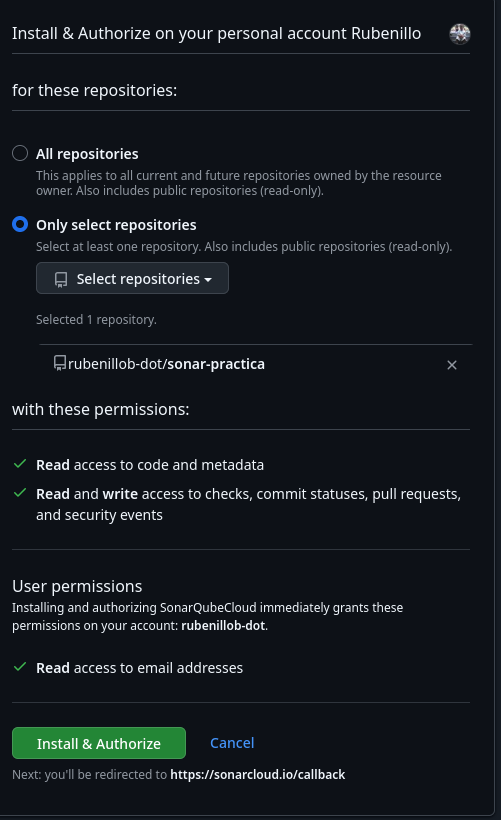
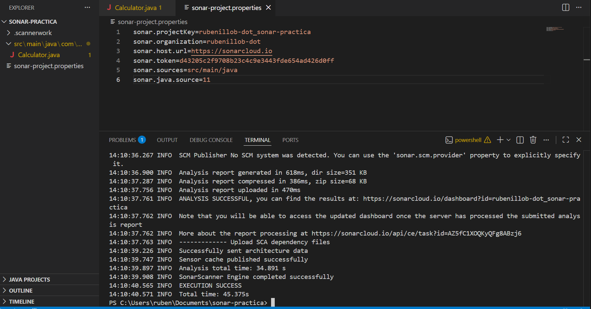

# Practica SonarCloud Entornos

### PASO 1: Preparación en GitHub (Crear el almacén de código)

*¿Qué es esto?* GitHub es una web donde guardas tu código. Vamos a crear un "Repositorio" (una carpeta online) para esta práctica.

1. Entra en [github.com](https://github.com/) e inicia sesión.
2. Arriba a la derecha, verás un icono de un **"+"** (junto a tu foto). Haz clic y elige **"New repository"**.
3. En **"Repository name"**, escribe exactamente: `sonar-practica`.
4. Asegúrate de que esté marcada la opción **"Public"** (esto es obligatorio para que SonarCloud sea gratis).
5. No toques nada más (ni README, ni .gitignore) y haz clic en el botón verde **"Create repository"**.
6. Te aparecerá una pantalla con una dirección URL (ejemplo: `https://github.com/tu-usuario/sonar-practica.git`). **Cópiala y guárdala**, la usaremos luego.
[https://github.com/rubenillob-dot/sonar-practica](https://github.com/rubenillob-dot/sonar-practica)

---

### PASO 2: Configuración en SonarCloud (Conectar la nube)

*¿Qué es esto?* SonarCloud es la herramienta que leerá tu código en busca de fallos. Tenemos que "presentarle" tu repositorio de GitHub.

1. Entra en [sonarcloud.io](https://sonarcloud.io/).
2. Haz clic en el botón **"Log in"** y selecciona el botón **"With GitHub"**.
3. Si te pide permiso para acceder a tu cuenta de GitHub (una ventana emergente), haz clic en el botón verde de **"Authorize"**.



1. Una vez dentro, busca un icono de **"+"** arriba a la derecha y haz clic en **"Analyze new project"**.
[https://sonarcloud.io/onboarding/create-organization?code=ddfbf294cd9bf3f7be0c&installation_id=134380364&setup_action=install&state=eyJkb3BUeXBlIjoiZ2l0aHViIiwiaXNPbmJvYXJkaW5nIjp0cnVlLCJpc0luaXRpYXRlZEZyb21Qcm9qZWN0U2V0dXAiOmZhbHNlLCJhcHAiOiJvcmdhbml6YXRpb24ifQ%3D%3D&projectSetup=false&mode=github&plan=free](https://sonarcloud.io/onboarding/create-organization?code=ddfbf294cd9bf3f7be0c&installation_id=134380364&setup_action=install&state=eyJkb3BUeXBlIjoiZ2l0aHViIiwiaXNPbmJvYXJkaW5nIjp0cnVlLCJpc0luaXRpYXRlZEZyb21Qcm9qZWN0U2V0dXAiOmZhbHNlLCJhcHAiOiJvcmdhbml6YXRpb24ifQ%3D%3D&projectSetup=false&mode=github&plan=free)


1. Te pedirá instalar SonarCloud en tu GitHub. Haz clic en **"Install SonarCloud on your organization"**, selecciona tu nombre de usuario y elige la opción de **"All repositories"** o solo el de `sonar-practica`. Dale a **Save/Install**.
2. Ahora, en la lista de SonarCloud, aparecerá `sonar-practica`. Selecciónalo marcando el cuadradito y dale al botón **"Set up"**.
3. **IMPORTANTE:** Te preguntará "¿How do you want to analyze your repository?". Haz clic en la opción que dice **"Manually"** (abajo a la derecha).
4. Elige **"Java"** como lenguaje.
5. Elige **"Other"** (para usar el scanner genérico).
**Tu Token es:** d43205c2f9708b23c4c9e3443fde654ad426d0ff
6. Se abrirá una pantalla con datos. **Copia estos tres valores en un bloc de notas**, los necesitarás para el archivo `.properties`:
**Tu Token es:** d43205c2f9708b23c4c9e3443fde654ad426d0ff
    - **Organization:** rubenillob-dot
    - **Project Key:** rubenillob-dot_sonar-practica

---

### PASO 3: Crear el proyecto en tu ordenador (Localmente)

*¿Qué es esto?* Ahora vamos a crear las carpetas y los archivos con errores en tu propio PC.

1. **Crea una carpeta en tu escritorio** llamada `practica-sonar`.
2. Entra en esa carpeta. Ahora vamos a crear la estructura de Java:
    - Crea una carpeta llamada `src`.
    - Entra en `src`, crea otra llamada `main`.
    - Entra en `main`, crea otra llamada `java`.
    - Entra en `java`, crea otra llamada `com`.
    - Entra en `com`, crea la última llamada `practica`.
    - *(Ruta final: practica-sonar/src/main/java/com/practica/)*.
3. Dentro de esa última carpeta (`practica`), haz clic derecho -> Nuevo -> Documento de texto. Cámbiale el nombre a **`Calculator.java`** (asegúrate de que no termine en .txt).
4. Abre ese archivo con el bloc de notas y pega el código "sucio" que viene en la **página 2 del PDF** (el que empieza por `public class Calculator`). Guarda y cierra.
5. Vuelve a la carpeta raíz (`practica-sonar`) y crea otro archivo de texto llamado **`sonar-project.properties`**.
6. Ábrelo y pega el contenido que anotaste en el Paso 2. Debería quedar algo así:*(Sustituye los valores por los que copiaste en el paso 2.10)*.
    
    ```
    sonar.projectKey=TU_PROJECT_KEY
    sonar.organization=TU_ORGANIZATION
    sonar.host.url=https://sonarcloud.io
    sonar.token=TU_TOKEN_GENERADO
    sonar.sources=src/main/java
    sonar.java.source=11
    ```
    

---

### PASO 4: Ejecutar el Análisis (Primer escaneo)

*¿Qué es esto?* Vamos a enviar el código a SonarCloud para que nos diga qué está mal.

1. Abre la terminal o "Símbolo del sistema" (CMD) en tu ordenador.
2. Escribe `cd` seguido de un espacio y arrastra la carpeta `practica-sonar` a la terminal para que se ponga la ruta. Pulsa Enter. (Ejemplo: `cd C:\\Users\\Usuario\\Desktop\\practica-sonar`).
3. Escribe el comando: **`sonar-scanner`** y pulsa Enter.
    - *Si te da error de que "no se reconoce el comando", es que no tienes instalado el scanner en tu PC (mira la pág 2 del PDF para descargarlo y añadirlo al PATH).*
4. Espera a que ponga **"EXECUTION SUCCESS"**.



Ve a tu panel de SonarCloud en el navegador.


- Refresca la página. Verás el proyecto con un cuadro **ROJO** que dice **"FAILED"**.
- Haz la captura donde se vea ese "FAILED" y los números: **2 Bugs** y **1 Code Smell**.

---

### PASO 5: Corregir los errores

*¿Qué es esto?* Vamos a arreglar el código para que sea "perfecto".

1. Abre de nuevo tu archivo `Calculator.java`.
2. **Corrige el Bug 1 (División por cero):** Cambia el método `divide` para que compruebe si `b` es cero.
3. **Corrige el Bug 2 (NullPointerException):** Cambia el método `status` para que si `val` es 0 o menos, devuelva un texto en lugar de intentar usar un nulo.
4. **Corrige el Code Smell:** Borra directamente las líneas del método `private void unused()`.


1. Guarda el archivo.
2. En la terminal (que sigue abierta), vuelve a escribir **`sonar-scanner`** y pulsa Enter.


---

### PASO 6: Subir el código a GitHub y Entrega final

*¿Qué es esto?* Subir el código final a la nube para que el profesor lo vea.

1. En la terminal, escribe estos comandos uno a uno (en la carpeta del proyecto):
    - `git init` (inicializa el control de versiones).
    - `git remote add origin URL_DE_TU_REPOSITORIO_PASO_1.6` (conecta tu PC con GitHub).
    - `git add .` (prepara los archivos).
    - `git commit -m "Solución de bugs"` (guarda los cambios).
    - `git push origin main` (sube el código).
2. Vuelve a SonarCloud. Ahora el cuadro debería estar en **VERDE** y decir **"PASSED"**.


- Haz una captura de SonarCloud donde se vea el estado **"PASSED"** en verde.

---

### Entregables :

1. **URL de GitHub:** Entras en tu repositorio y copias la dirección del navegador.
[https://github.com/rubenillob-dot/sonar-practica](https://github.com/rubenillob-dot/sonar-practica)
2. **URL de SonarCloud:** Entras en tu proyecto en SonarCloud y copias la dirección.
[https://sonarcloud.io/project/issues?issueStatuses=OPEN%2CCONFIRMED&id=rubenillob-dot_sonar-practica](https://sonarcloud.io/project/issues?issueStatuses=OPEN%2CCONFIRMED&id=rubenillob-dot_sonar-practica)
3. **La Captura 1:** El panel en rojo con los 2 bugs del principio.


1. **El código:** El archivo `Calculator.java` ya corregido (esta en github)
